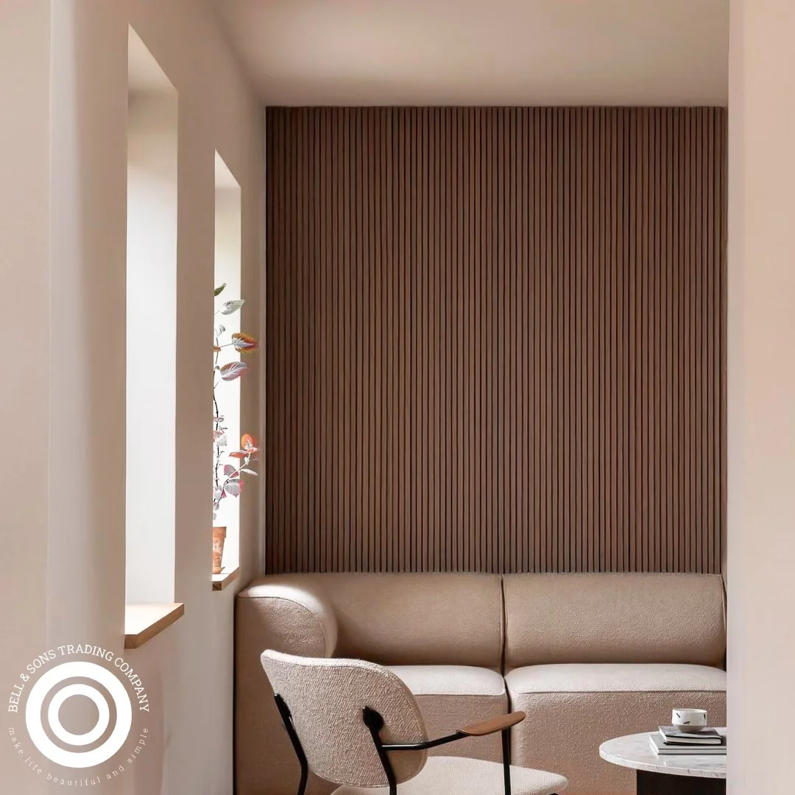

    <h2 class="font-bold text-lg mb-3 text-primary">
        <i class="fas fa-lightbulb mr-2"></i>
        Resumen Ejecutivo
    </h2>
    

        Esta guía compara las diferencias clave entre el lambrín WPC y la lámina decorativa de "mármol PVC". Analizamos la apariencia, el costo total de propiedad, la durabilidad, el aislamiento acústico, la resistencia a la humedad y el mantenimiento. El objetivo es claro: determinar cuándo elegir un revestimiento WPC premium para un resultado duradero y cuándo una lámina decorativa es suficiente para proyectos de bajo tráfico o presupuesto limitado.
    

Al momento de seleccionar un revestimiento para muros interiores, el mercado ofrece un abanico de opciones que prometen estética y funcionalidad. Dos de los materiales más consultados son el [lambrín WPC](/blog/lambrin-wpc-queretaro) y las láminas decorativas de PVC, a menudo llamadas "mármol PVC". Aunque ambos pueden ofrecer un acabado visualmente atractivo, sus diferencias estructurales, de rendimiento y de costo a largo plazo son sustanciales.

Entender estas diferencias es crucial para tomar una decisión informada que se alinee con las expectativas del proyecto, el uso del espacio y la inversión deseada, especialmente en el mercado de Querétaro donde la calidad y durabilidad son fundamentales.

## ¿Qué es la lámina de "mármol PVC"?

A diferencia del WPC, que es un compuesto sólido de madera y plástico, la lámina de "mármol PVC" es una solución fundamentalmente distinta. Se trata de un panel delgado y ligero de PVC (policloruro de vinilo) sobre el cual se imprime una imagen de alta resolución que imita la apariencia de una placa de mármol, granito u otra piedra natural. Generalmente, se le aplica una capa protectora UV para darle brillo y cierta resistencia.

    <h3 class="font-semibold text-xl mb-3 text-primary">
        <i class="fas fa-info-circle mr-2"></i>
        Características del Mármol PVC
    </h3>
    <ul class="space-y-2 text-lg text-gray-700">
        <li class="flex items-start">
            <i class="fas fa-layer-group text-accent mr-3 mt-1"></i>
            <strong>Estructura:</strong> Panel de PVC, a menudo con una estructura de panal o celdas para darle rigidez sin añadir peso.
        </li>
        <li class="flex items-start">
            <i class="fas fa-palette text-accent mr-3 mt-1"></i>
            <strong>Acabado:</strong> Una película decorativa impresa y una capa de laca brillante.
        </li>
        <li class="flex items-start">
            <i class="fas fa-magic text-accent mr-3 mt-1"></i>
            <strong>Propósito:</strong> Principalmente estético, diseñado para cubrir superficies de forma rápida y económica.
        </li>
    </ul>

## Comparativa directa: WPC vs. Lámina de Mármol PVC

La elección entre un material y otro depende de las prioridades del proyecto. La siguiente tabla desglosa las características más importantes para una comparación objetiva.

    <table class="w-full border-collapse bg-white shadow-sm rounded-lg overflow-hidden">
        <caption class="text-left mb-4 font-italic text-gray-600">Tabla comparativa de rendimiento: WPC vs. Lámina PVC</caption>
        <thead>
            <tr class="bg-primary text-white">
                <th class="p-4 text-left">Atributo</th>
                <th class="p-4 text-left">Lambrín WPC Premium</th>
                <th class="p-4 text-left">Lámina Decorativa "Mármol PVC"</th>
            </tr>
        </thead>
        <tbody>
            <tr class="border-b border-gray-200">
                <td class="p-4 font-medium">Composición</td>
                <td class="p-4 text-green-600">Compuesto sólido de madera y polímeros</td>
                <td class="p-4 text-orange-600">Panel delgado de PVC con capa impresa</td>
            </tr>
            <tr class="bg-gray-50 border-b border-gray-200">
                <td class="p-4 font-medium">Sensación al tacto y solidez</td>
                <td class="p-4 text-green-600">Robusto, denso, similar a madera dura</td>
                <td class="p-4 text-orange-600">Ligero, hueco, plástico al tacto</td>
            </tr>
            <tr class="border-b border-gray-200">
                <td class="p-4 font-medium">Resistencia a impactos</td>
                <td class="p-4 text-green-600">Alta. Resiste golpes y abolladuras</td>
                <td class="p-4 text-red-600">Baja. Susceptible a perforaciones y abolladuras</td>
            </tr>
            <tr class="bg-gray-50 border-b border-gray-200">
                <td class="p-4 font-medium">Aislamiento acústico</td>
                <td class="p-4 text-green-600">Bueno. Su densidad ayuda a reducir el eco</td>
                <td class="p-4 text-red-600">Mínimo o nulo. Puede generar eco</td>
            </tr>
            <tr class="border-b border-gray-200">
                <td class="p-4 font-medium">Reparación</td>
                <td class="p-4 text-green-600">Se puede reemplazar un solo panel fácilmente</td>
                <td class="p-4 text-red-600">Difícil de reparar sin que se note; usualmente se reemplaza todo el panel</td>
            </tr>
            <tr class="bg-gray-50 border-b border-gray-200">
                <td class="p-4 font-medium">Costo Inicial (Material)</td>
                <td class="p-4 text-orange-600">Mayor inversión por m²</td>
                <td class="p-4 text-green-600">Menor inversión por m²</td>
            </tr>
            <tr>
                <td class="p-4 font-medium">Valor a largo plazo</td>
                <td class="p-4 text-green-600">Alto. Durabilidad y bajo mantenimiento</td>
                <td class="p-4 text-red-600">Bajo. Propenso a reemplazo por desgaste o daño</td>
            </tr>
        </tbody>
    </table>

    
    
La estructura sólida del WPC es clave para su durabilidad y aislamiento acústico.

## ¿Cuándo elegir un revestimiento WPC?

El lambrín WPC es la elección técnica y estética para proyectos que buscan permanencia, calidad y un rendimiento superior. Es ideal cuando:

    

        <h3 class="font-semibold text-xl mb-3 text-green-700">
            <i class="fas fa-users mr-2"></i>
            Alto Tráfico
        </h3>
        
El muro está en una zona de alto tráfico como pasillos, recepciones, áreas comerciales o salas de estar.

    

    

        <h3 class="font-semibold text-xl mb-3 text-green-700">
            <i class="fas fa-volume-down mr-2"></i>
            Aislamiento Acústico
        </h3>
        
Se busca un mejor aislamiento acústico y una sensación de solidez en el espacio.

    

    

        <h3 class="font-semibold text-xl mb-3 text-green-700">
            <i class="fas fa-shield-alt mr-2"></i>
            Durabilidad Premium
        </h3>
        
La durabilidad y resistencia a largo plazo son una prioridad sobre el costo inicial.

    

    

        <h3 class="font-semibold text-xl mb-3 text-green-700">
            <i class="fas fa-tree mr-2"></i>
            Apariencia Natural
        </h3>
        
El diseño requiere una textura y apariencia más natural y menos artificial.

    

## ¿En qué escenarios es adecuada una lámina de PVC?

La lámina decorativa de PVC tiene su lugar en aplicaciones específicas donde sus ventajas (costo y ligereza) superan sus desventajas. Considere esta opción si:

    <ul class="space-y-3 text-lg text-gray-700">
        <li class="flex items-start">
            <i class="fas fa-dollar-sign text-yellow-600 mr-3 mt-1"></i>
            El <strong>presupuesto es el factor más limitante</strong> y se necesita una solución de impacto visual inmediato.
        </li>
        <li class="flex items-start">
            <i class="fas fa-walking text-yellow-600 mr-3 mt-1"></i>
            El muro a cubrir está en una <strong>zona de muy bajo tráfico</strong>, como un muro de acento en una recámara o un set de filmación temporal.
        </li>
        <li class="flex items-start">
            <i class="fas fa-rocket text-yellow-600 mr-3 mt-1"></i>
            Se requiere una <strong>instalación extremadamente rápida</strong> y sobre una superficie existente sin demolición.
        </li>
        <li class="flex items-start">
            <i class="fas fa-calendar-alt text-yellow-600 mr-3 mt-1"></i>
            El proyecto es de <strong>naturaleza temporal</strong> o se planea una remodelación a corto o mediano plazo.
        </li>
    </ul>

## Preguntas Frecuentes sobre WPC vs PVC

    

        

            ¿Qué es exactamente el 'mármol PVC'?
            <i class="fas fa-chevron-down text-primary"></i>
        

        

            
El término 'mármol PVC' generalmente se refiere a una lámina o panel delgado de PVC (policloruro de vinilo) con una capa superficial impresa que imita la apariencia del mármol u otras piedras. Es una solución principalmente decorativa, ligera y de bajo costo inicial, a diferencia del WPC que es un material compuesto, sólido y estructural.

        

    

    

        

            ¿La lámina de PVC resiste bien la humedad y los golpes?
            <i class="fas fa-chevron-down text-primary"></i>
        

        

            
La lámina de PVC es 100% resistente al agua, por lo que no se daña con la humedad. Sin embargo, su resistencia a los golpes es baja. Al ser una lámina delgada, puede abollarse o perforarse con impactos moderados, mientras que el WPC, por su densidad y solidez, ofrece una resistencia a impactos significativamente mayor.

        

    

    

        

            ¿Cuál es la diferencia de costo total entre WPC y mármol PVC?
            <i class="fas fa-chevron-down text-primary"></i>
        

        

            
Inicialmente, el costo por metro cuadrado de la lámina de PVC es menor que el del WPC. Sin embargo, el costo total de propiedad a largo plazo puede ser más alto para el PVC si se consideran reparaciones o reemplazos por daños. El WPC representa una inversión inicial mayor, pero su durabilidad y bajo mantenimiento justifican el costo en proyectos de alto tráfico o que buscan una vida útil prolongada.

        

    

    

        

            ¿Se puede reparar un muro de WPC o de lámina PVC si se daña?
            <i class="fas fa-chevron-down text-primary"></i>
        

        

            
Reparar una abolladura en una lámina de PVC es muy difícil sin que sea evidente. Generalmente, requiere reemplazar el panel completo. En el WPC, los rayones superficiales a veces pueden disimularse, y al ser paneles modulares, reemplazar una sola pieza dañada es un proceso más sencillo y estético.

        

    

    <h2 class="font-display text-3xl font-bold mb-4">
        ¿Aún no decide? Permítanos asesorarle
    </h2>
    

        Nuestro equipo puede proporcionarle fichas técnicas, muestras y una cotización detallada para ayudarle a tomar la mejor decisión para su proyecto en Querétaro.
    

    

        <a href="http://qr.ahuehuetedigital.com/whatsappbands" target="_blank" rel="noopener noreferrer" class="inline-flex items-center px-8 py-4 bg-white text-primary font-semibold rounded-lg hover:bg-gray-100 transition-all shadow-lg">
            <i class="fab fa-whatsapp mr-3 text-xl"></i>
            Consultar con un experto
        </a>
        <a href="https://heyzine.com/flip-book/288d86d021.html" target="_blank" rel="noopener noreferrer" class="inline-flex items-center px-8 py-4 border-2 border-white text-white font-semibold rounded-lg hover:bg-white hover:text-primary transition-all">
            <i class="fas fa-book-open mr-3"></i>
            Explorar Catálogo WPC
        </a>
    

